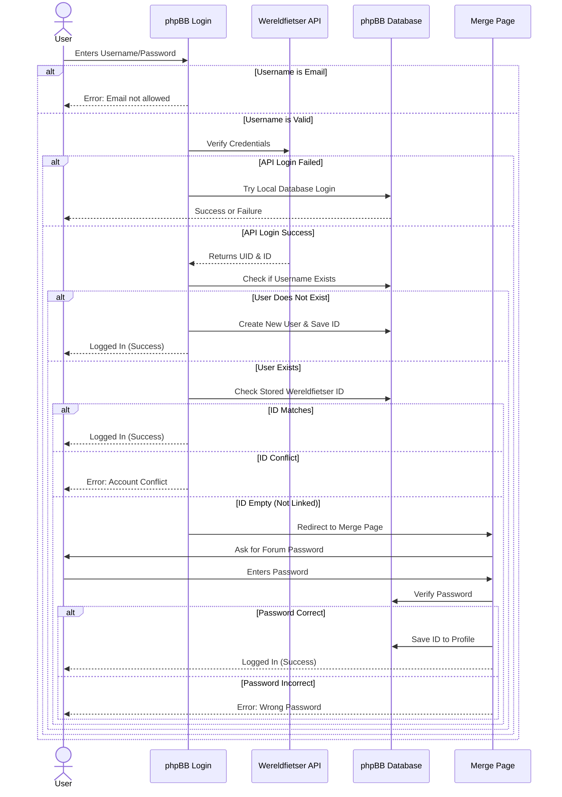
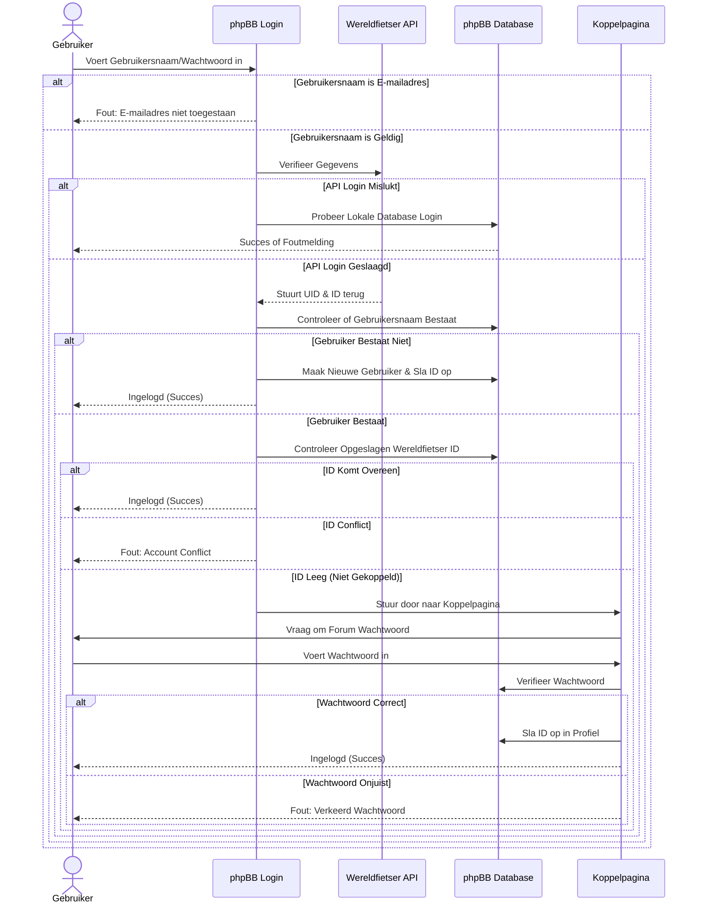

# Wereldfietser Login & Account Linking Flow

This document describes the authentication logic implemented in the Wereldfietser extension. It handles user login via the Wereldfietser API and manages the linking of API accounts to existing phpBB forum accounts.

## Overview

The system prioritizes authentication via the external Wereldfietser API. If the API login is successful, the system ensures the user has a corresponding local phpBB account. If an existing forum account with the same username is found but not yet linked, the user is redirected to a merge page to confirm ownership.

## Process Flow (English)

1.  **Login Attempt & Validation**
    *   **User** enters `username` and `password`.
    *   **System** checks input format.
    *   **Decision:**
        *   **If Email Address:** Show error "Email login not allowed". **End.**
        *   **If Valid Username:** Proceed to Step 2.

2.  **API Authentication**
    *   System sends credentials to **Wereldfietser API**.
    *   **Decision:**
        *   **If API Fails (401/403):** Fallback to standard **phpBB Database** login. **End.**
        *   **If API Succeeds (200 OK):** API returns `uid` and `id`. Proceed to Step 3.

3.  **Check for Existing Forum User**
    *   System checks **phpBB Database** for a user with the same `username`.
    *   **Decision:**
        *   **If NO User Found:** Create new phpBB user, save `wereldfietser_id`, and log in. **Success.**
        *   **If User IS Found:** Proceed to Step 4.

4.  **Check Link Status (Existing User)**
    *   System checks the `pf_wereldfietser_id` profile field.
    *   **Decision:**
        *   **If ID Matches:** User is already linked. Log in. **Success.**
        *   **If ID is Empty (Not Linked):** Trigger `WERELDFIETSER_LINK_ACCOUNT` signal. Proceed to Step 5.
        *   **If ID Differs:** Return "Account Conflict" error. **Error.**

5.  **Redirect (Event Listener)**
    *   Listener catches the signal and redirects the user to the **Merge Page**.

6.  **Account Linking (Merge Page)**
    *   **User** enters **Forum Password** to confirm ownership.
    *   **Decision:**
        *   **Password Correct:** Save ID to profile and log in. **Success.**
        *   **Password Incorrect:** Show error message.

### Mermaid Diagram

---

## Procesverloop (Nederlands)

1.  **Inlogpoging & Validatie**
    *   **Gebruiker** voert `gebruikersnaam` en `wachtwoord` in.
    *   **Systeem** controleert de invoer.
    *   **Beslissing:**
        *   **Als E-mailadres:** Toon foutmelding "Inloggen met e-mailadres niet toegestaan". **Einde.**
        *   **Als Geldige Gebruikersnaam:** Ga door naar Stap 2.

2.  **API Authenticatie**
    *   Systeem stuurt gegevens naar **Wereldfietser API**.
    *   **Beslissing:**
        *   **Als API Mislukt:** Val terug op **phpBB Database** login. **Einde.**
        *   **Als API Slaagt:** API stuurt `uid` en `id` terug. Ga door naar Stap 3.

3.  **Controleer op Bestaande Forumgebruiker**
    *   Systeem zoekt in **phpBB Database** naar gebruiker met dezelfde `gebruikersnaam`.
    *   **Beslissing:**
        *   **Als GEEN Gebruiker:** Maak nieuwe gebruiker aan, sla ID op, en log in. **Succes.**
        *   **Als WEL Gebruiker:** Ga door naar Stap 4.

4.  **Controleer Koppelstatus**
    *   Systeem controleert het `pf_wereldfietser_id` veld.
    *   **Beslissing:**
        *   **Als ID Overeenkomt:** Log in. **Succes.**
        *   **Als ID Leeg is:** Activeer `WERELDFIETSER_LINK_ACCOUNT` signaal. Ga door naar Stap 5.
        *   **Als ID Afwijkt:** Geef "Account Conflict" foutmelding. **Fout.**

5.  **Doorverwijzing**
    *   Systeem stuurt gebruiker door naar de **Koppelpagina**.

6.  **Account Koppelen**
    *   **Gebruiker** voert **Forum Wachtwoord** in.
    *   **Beslissing:**
        *   **Wachtwoord Juist:** Sla ID op en log in. **Succes.**
        *   **Wachtwoord Onjuist:** Toon foutmelding.

### Mermaid Diagram (NL)

